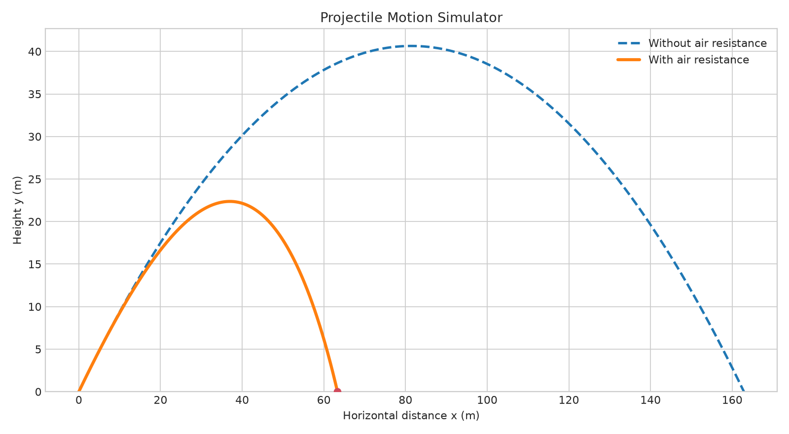

# Projectile Motion Simulator

空気抵抗を考慮した投射運動を、ブラウザ上でシミュレーションできるアプリです。

物理学で学んだ運動方程式を実際にプログラムへ落とし込み、空気抵抗が軌道や到達距離にどのような影響を与えるのか確認するために制作しました。



## このプロジェクトについて

初速度や投射角度などの条件を変更し、空気抵抗がある場合とない場合の軌道を比較できます。

空気抵抗には、速度の2乗に比例するモデル

```text
F = -k|v|v
```

を使用しています。空気抵抗がある場合の運動方程式は解析的に扱いにくいため、半陰的オイラー法によって数値計算しています。

## できること

- 初速度と投射角度の変更
- 質量と空気抵抗係数の変更
- 空気抵抗あり・なしの軌道比較
- 飛行時間、最大高度、水平到達距離の表示
- 時刻ごとの位置・速度データの確認
- 計算結果のCSV出力

## 使用技術

- Python
- NumPy
- Pandas
- Matplotlib
- Streamlit
- Pytest

## 実行方法

リポジトリをダウンロードした後、プロジェクトのフォルダ内で以下を実行します。

```bash
python -m venv .venv
source .venv/bin/activate
pip install -r requirements.txt
streamlit run app.py
```

Windowsの場合は、仮想環境を次のコマンドで有効化します。

```bash
.venv\Scripts\activate
```

起動後、ブラウザで以下のURLを開きます。

```text
http://localhost:8501
```

## テスト

物理計算部分のテストは、以下のコマンドで実行できます。

```bash
pytest -q
```

## ファイル構成

```text
.
├── app.py
├── physics.py
├── requirements.txt
├── assets/
│   └── demo.png
├── scripts/
│   └── generate_demo.py
└── tests/
    └── test_physics.py
```

- `app.py`：Streamlitによる画面表示
- `physics.py`：投射運動の数値計算
- `assets/`：READMEで使用する画像
- `scripts/`：補助スクリプト
- `tests/`：物理計算のテスト

## 制作を通して確認したこと

この制作では、数式をそのままコードに書くのではなく、計算部分と画面表示を分けて実装しました。

また、空気抵抗がない場合の解析解と数値計算の結果を比較し、時間刻みが計算精度に与える影響も確認しました。

## English

This is a small Streamlit application for simulating projectile motion with and without quadratic air resistance.

The project was created to apply the equations studied in physics to a working program and to compare analytical and numerical results.


## License

This project is licensed under the MIT License.

## Author

Hank
GitHub: https://github.com/shianjeng
